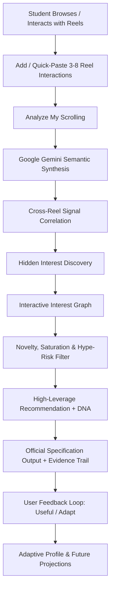

# TECHREEL AI ⚡
> **"Turn your scrolling into smarter technology discovery."**

[](https://github.com/ravishankar5353/rgm_prompt_wars-2026.git)
[](https://aistudio.google.com/)
[](https://vitejs.dev/)

---

## 1. Problem Statement
Students spend significant time scrolling short-form video feeds (Reels, Shorts, TikTok). While much of this content provides harmless entertainment, it rarely delivers educational depth or career leverage. 

Current recommendation algorithms optimize strictly for short-term engagement and shallow keyword matching, frequently trapping students in repetitive meme loops (e.g., watching a Java joke leads to more basic Java jokes).

---

## 2. Motivation
The goal is **not** to stop social media usage or fight human scrolling behavior. The goal is to **make existing scrolling more useful** by transforming casual entertainment interactions into structured, high-leverage technology discovery and career acceleration.

---

## 3. Solution Overview
**TechReel AI** is an explainable, adaptive AI recommendation agent that analyzes multiple Reel interactions, infers underlying technical interests and career aspirations through cross-reel semantic reasoning, and recommends engaging, high-retention technology micro-learning content tailored to the student's emerging engineering trajectory.

---

## 4. Innovation & The Official Built-in Trap

### The Trap Scenario
A student interacts with:
1. **Java programming meme** (NullPointerException joke)
2. **Software-engineer lifestyle Reel** (Backend day-in-the-life, microservices)
3. **Coding interview joke** (Inverting a binary tree whiteboard challenge)
4. **Laptop comparison** (MacBook M3 Max vs ThinkPad for Docker builds)

### Shallow Keyword System vs. TechReel AI Agent

| Dimension | Traditional Keyword System | TechReel AI Agent (Our Innovation) |
| :--- | :--- | :--- |
| **Input Analysis** | Naive extraction: `"Java"`, `"Laptop"` | Multi-signal semantic synthesis |
| **Inferred Domain** | Surface keyword repetition | **Software Engineering / Distributed Systems** |
| **Recommendation** | *Top 5 Beginner Java Variables & If-Else Loops* | **High-Level Design (HLD): Microservices Cache Invalidation at Scale** |
| **Novelty Score** | 18% (Trapped in beginner loop) | **88% (Career acceleration milestone)** |
| **Hype Risk** | High (Generic clickbait & sales pitches) | **Low (Deep architectural engineering)** |
| **Outcome** | Stagnation | **High-leverage career milestone** |

---

## 5. Core User Workflow



---

## 6. Key Features (P0, P1, P2)

### P0 — Core Capabilities
- **ChatGPT-Style Native Interface**: Seamless conversation sidebar, chat streams, quick suggestion pills, and voice input.
- **User Reel Management**: Add, edit, delete, reorder, and review interactions with category tags, watch completion %, and interaction types (Watched, Liked, Saved, Shared).
- **Quick Add Bar**: Instant paste box for captions and descriptions with auto-category detection.
- **Real Google Gemini AI Integration**: Live connection to Gemini 1.5 Flash with structured JSON output and schema validation.
- **Hidden Interest Discovery**: Visually dominant hero card displaying inferred domain, confidence score, and contributing signal chains.
- **Required Output Specification**: Strictly formatted PromptWars output card containing:
  - `CURRENT REEL REFERENCE`
  - `INTEREST DETECTED`
  - `WHY (EVIDENCE)`
  - `RECOMMENDED TECH REEL`
  - `CATEGORY`
  - `WHY THIS RECOMMENDATION`
  - `DIFFICULTY`
  - `CONFIDENCE`
- **Recommendation DNA**: Explainable AI-estimated signals (Interest Match, Context Match, Novelty, Learning Value, Difficulty Fit, Hype Risk).
- **Why This / Why Not Cards**: Explicit breakdown of why the recommendation was selected, why keyword repetition was rejected, and why generic hype was filtered out.
- **Topic Saturation Detector**: Identifies repeated categories (e.g. 3+ Java/AI reels) and explores adjacent engineering fields (HLD, Distributed Caching, Cloud, DevOps).
- **Focus vs. Explore Modes**: Toggle between maximum relevance (`Focus Mode`) and novel horizon discovery (`Explore Mode`).
- **Judge Demo Mode (`⚡ TRY JUDGE DEMO`)**: 60-second guided walkthrough of the official trap and agentic reasoning breakthrough.

### P1 & P2 — Advanced Capabilities
- **Interactive Interest Graph**: Hierarchical SVG node graph mapping Root -> Domain -> Subdomain -> Concepts.
- **Semantic vs. Keyword Benchmark**: Side-by-side comparative analysis card.
- **Mixed Signal Detector**: Detects unfocused entertainment inputs (food, comedy, pets) and transparently suggests adding technical signals without fabricating false interests.
- **Interest Evolution Progression**: Historical tracking of Earlier -> Current -> Emerging interests.
- **Analytics Dashboard**: Distribution charts for categories, confidence metrics, feedback rates, and exploration usage.
- **What-If Predictive Simulator**: Previews how watching Cybersecurity, Cloud, Quantum, or Robotics reels would shift your interest graph without modifying active data.
- **Privacy & Security Center**: Complete data transparency, single-click JSON export, and local data deletion.
- **Voice Dictation**: Web Speech API integration with graceful text input fallback.
- **Supabase Cloud + Resilient Local Persistence**: Works out of the box locally and supports cloud Supabase instances with Row-Level Security (RLS).

---

## 7. Tech Stack

- **Frontend Core**: React 19, TypeScript, Vite
- **Styling**: Custom Glassmorphism Design System (CSS Custom Properties, Fluid Layouts, Dark/Light Themes, High-Contrast & Reduced-Motion accessibility)
- **AI Reasoning**: Google Gemini API (`@google/generative-ai`), Custom Deterministic Fallback Engine
- **Database & Auth**: Supabase (`@supabase/supabase-js`) with Postgres RLS + Browser LocalStorage Sync
- **Icons & Polish**: Lucide React, Canvas Confetti
- **Testing**: Vitest automated test suite

---

## 8. Supabase Architecture & Row Level Security

The Postgres database schema is located in `supabase/schema.sql` and includes:
1. `profiles`: User account details and preferences.
2. `reel_interactions`: Logged reel title, caption, watch %, and interaction type.
3. `detected_interests`: Inferred domains and confidence metrics.
4. `recommendations`: Delivered recommendations, DNA metrics, and explainability records.
5. `recommendation_feedback`: Student ratings and rejection reasons.
6. `notifications`: In-app alert history.

All tables are protected with Row Level Security (`ENABLE ROW LEVEL SECURITY`) ensuring users can only read and write their own data.

---

## 9. Setup & Installation

### Prerequisites
- Node.js 18+ (tested on Node v24.14.0)
- npm 9+

### 1. Clone & Install
```bash
git clone https://github.com/ravishankar5353/rgm_prompt_wars-2026.git
cd rgm_prompt_wars-2026
npm install
```

### 2. Configure Environment Variables
Copy `.env.example` to `.env`:
```bash
cp .env.example .env
```
Fill in your Google Gemini API key (optional for demo; local deterministic reasoning is enabled by default):
```env
VITE_GEMINI_API_KEY=your_gemini_api_key_here
VITE_SUPABASE_URL=https://your-project.supabase.co
VITE_SUPABASE_ANON_KEY=your_supabase_anon_key_here
VITE_DEMO_MODE=true
```

### 3. Run Development Server
```bash
npm run dev
```
Open [http://localhost:5173](http://localhost:5173) in your browser.

### 4. Run Automated Test Suite
```bash
npm run test
```

### 5. Production Build
```bash
npm run build
```

---

## 10. Vercel Deployment
TechReel AI is 100% Vercel-ready with zero server-side lock-in.

1. Push your repository to GitHub.
2. Import the repository in [Vercel](https://vercel.com).
3. Add environment variables (`VITE_GEMINI_API_KEY`, `VITE_SUPABASE_URL`, `VITE_SUPABASE_ANON_KEY`).
4. Click **Deploy**.

---

## 11. Security & Privacy
- Zero scraping of private Instagram/TikTok passwords or social accounts.
- API keys are handled securely via environment variables or encrypted in browser session memory.
- Personal data can be reviewed, exported as JSON, or wiped in one click via the Privacy Center.

---

## 12. Limitations & Future Scope
- **Current Limitation**: Reel interactions are provided via titles, captions, and links rather than direct real-time video pixel processing.
- **Future Scope**: Direct integration with Gemini 1.5 Pro multimodal video API for automated video transcription, timeline bookmarking, and personalized interactive coding playgrounds.

---

**Built with pride for PromptWars 2026 by the TechReel AI Engineering Team.**
